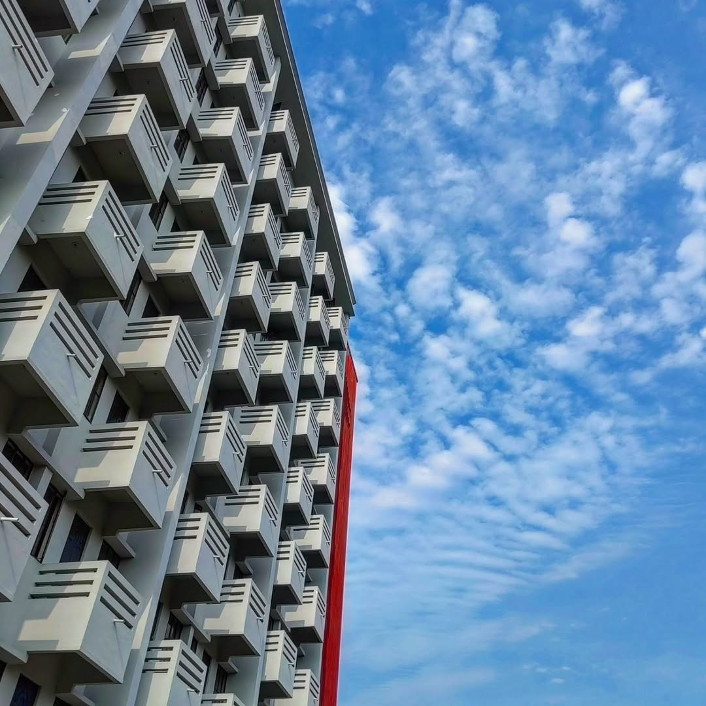

# Quick Start Guide - Portfolio Version 7

## 🚀 Getting Started in 3 Steps

### Step 1: Extract the Files
```bash
# Download from Google Drive and extract
unzip "Ahosan Habib Likhon Portfolio -version 7.zip"
cd portfolio-v7
```

### Step 2: Test Locally
```bash
# Simply open index.html in your browser
# On Windows:
start index.html

# On Mac:
open index.html

# On Linux:
xdg-open index.html
```

### Step 3: Deploy to GitHub Pages
```bash
# Initialize git repository
git init
git add .
git commit -m "Initial commit: Portfolio V7"

# Create repository on GitHub, then:
git remote add origin https://github.com/yourusername/yourrepo.git
git branch -M main
git push -u origin main

# Enable GitHub Pages:
# Go to Settings → Pages → Source: main branch → Save
```

Your site will be live at: `https://yourusername.github.io/yourrepo`

---

## ✅ What's Already Done

- ✅ All 25 Instagram photos converted and added
- ✅ Professional SVG molecular structures
- ✅ Animated DNA helix background
- ✅ Photography gallery with filters
- ✅ Responsive design (mobile-ready)
- ✅ Dark/light mode toggle
- ✅ GitHub integration (auto-fetches repos)
- ✅ SEO optimized
- ✅ Fast loading & performance optimized

---

## 🎨 Customization Checklist

### Priority 1: Must Do
- [ ] Replace `assets/resume.pdf` with your actual resume
- [ ] Update email address if different (currently: likhonahosan5@gmail.com)
- [ ] Add LinkedIn URL (currently placeholder)
- [ ] Verify all social media links work

### Priority 2: Recommended
- [ ] Reorganize photos by category (nature/portrait/mobile)
- [ ] Add more photos if you have them
- [ ] Update "About Me" section with your personal story
- [ ] Add your actual research projects/publications
- [ ] Customize color scheme (if desired)

### Priority 3: Optional
- [ ] Add more GitHub repositories manually
- [ ] Create custom favicon
- [ ] Add Google Analytics
- [ ] Add more sections (blog, publications, etc.)

---

## 📸 Managing Your Photography Gallery

### Current Photo Distribution:
- **Nature**: photo-01 to photo-08 (8 photos)
- **Portrait**: photo-09 to photo-16 (8 photos)
- **Mobile**: photo-17 to photo-25 (9 photos)

### To Reorganize Photos:
Edit `index.html` and change the `data-category`:

```html
<!-- Change from nature to portrait -->
<div class="photo-item" data-category="portrait">
    
    ...
</div>
```

### To Add More Photos:
1. Save JPG files to `assets/images/photography/`
2. Name them: `photo-26.jpg`, `photo-27.jpg`, etc.
3. Add HTML in the gallery section:

```html
<div class="photo-item" data-category="nature">
    
    <div class="photo-overlay">
        <a href="https://instagram.com/ahosan.photo"
           target="_blank" class="photo-link">View on Instagram</a>
    </div>
</div>
```

---

## 🎨 Color Customization

### To Change the Color Theme:

Open `style.css` and edit the `:root` section:

```css
:root {
  /* Change these colors */
  --accent: #10b981;      /* Main green */
  --accent-2: #14b8a6;    /* Teal */
  --accent-3: #06b6d4;    /* Cyan */

  /* Gradients automatically update based on accents */
  --gradient-1: linear-gradient(135deg, var(--accent) 0%, var(--accent-2) 100%);
}
```

**Color Suggestions:**
- **Blue Theme**: `#3b82f6`, `#60a5fa`, `#93c5fd`
- **Purple Theme**: `#8b5cf6`, `#a78bfa`, `#c084fc`
- **Red Theme**: `#ef4444`, `#f87171`, `#fca5a5`
- **Orange Theme**: `#f97316`, `#fb923c`, `#fdba74`

---

## 🐛 Troubleshooting

### Photos Not Showing?
**Solution**: Check file paths are correct:
```
assets/images/photography/photo-01.jpg
```
All paths are relative to `index.html`

### GitHub Repos Not Loading?
**Solution**:
1. Check your internet connection
2. Open browser console (F12) to see errors
3. GitHub API limit: 60 requests/hour (unauthenticated)

### Gallery Filters Not Working?
**Solution**: Make sure JavaScript is enabled in your browser

### Website Looks Different Than Expected?
**Solution**:
1. Clear browser cache (Ctrl+Shift+Delete)
2. Force reload (Ctrl+F5 or Cmd+Shift+R)
3. Try a different browser

---

## 📱 Testing Checklist

Before deploying, test on:

- [ ] Desktop browser (Chrome/Firefox/Edge)
- [ ] Mobile phone (portrait mode)
- [ ] Mobile phone (landscape mode)
- [ ] Tablet
- [ ] Different screen sizes (use browser dev tools)
- [ ] Dark mode
- [ ] Light mode
- [ ] All navigation links work
- [ ] All social media links work
- [ ] Gallery filters work
- [ ] Lightbox opens/closes
- [ ] Forms submit (or show proper behavior)
- [ ] Resume downloads

---

## 🔗 Important Links

- **Your GitHub**: https://github.com/ahosanhabiblikhon
- **Instagram**: https://instagram.com/ahosan.photo
- **Facebook**: https://www.facebook.com/ahosan.habib.likhon.nur

---

## 💡 Pro Tips

1. **Optimize Images**: Already done! All photos are optimized for web.

2. **SEO**: Update meta tags in `index.html` if you want different descriptions.

3. **Performance**: The site loads fast. Don't add heavy libraries unless needed.

4. **Mobile-First**: Website is already mobile-optimized. Test on real devices!

5. **Updates**: To update your GitHub repos, just refresh the page (they load dynamically).

6. **Custom Domain**: You can add a custom domain in GitHub Pages settings.

7. **HTTPS**: GitHub Pages provides free HTTPS automatically.

---

## 📞 Need Help?

If you encounter issues:

1. Check the browser console (F12 → Console tab)
2. Review `CHANGELOG.md` for details
3. Read `README.md` for comprehensive documentation
4. Check file paths and image names

---

## 🎓 What You Learned

This project demonstrates:
- Modern HTML5 semantic markup
- CSS Grid & Flexbox layouts
- Canvas API for animations
- SVG graphics and styling
- Vanilla JavaScript (no frameworks)
- Responsive design principles
- Image optimization
- Git & GitHub Pages deployment
- Performance optimization
- Accessibility best practices

---

**You're ready to go! 🚀**

Just replace the resume, verify your links, and deploy to GitHub Pages.

Good luck with your portfolio!

*Built with 💚 by Ahosan Habib Likhon*
